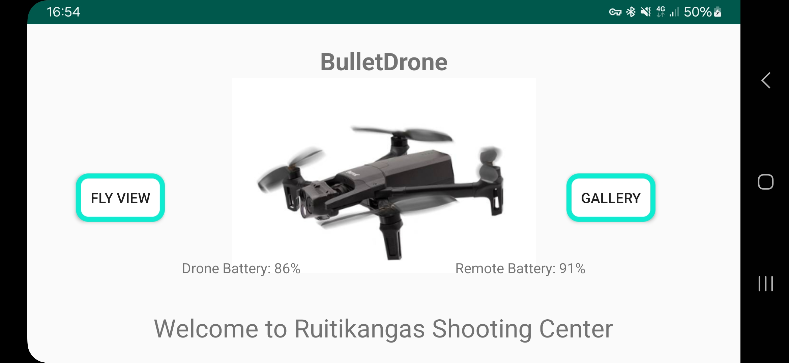
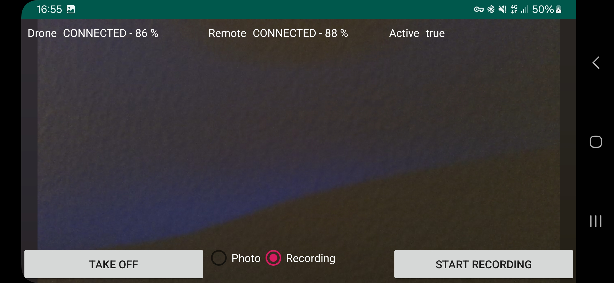
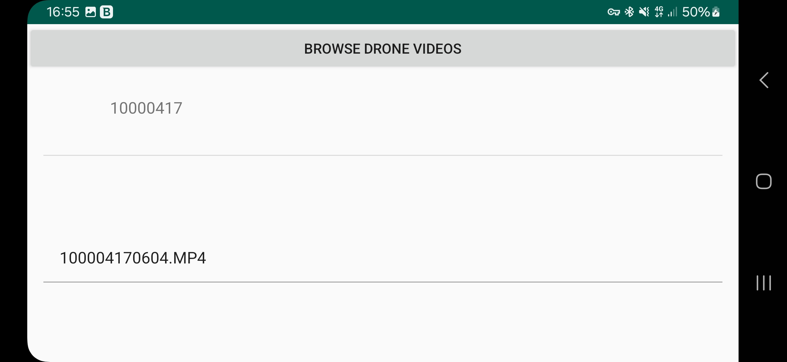
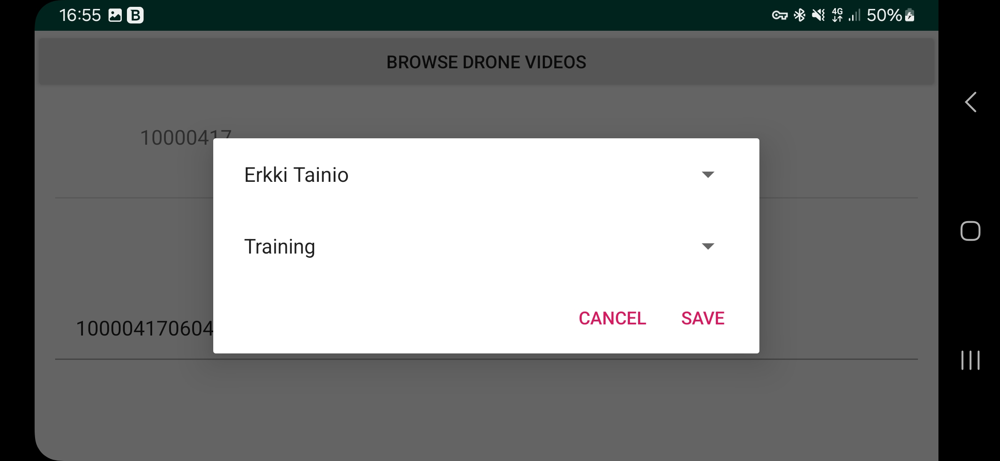
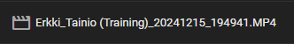

# BulletDrone

**BulletDrone** is a Kotlin-based mobile application designed for a shooting range to record shooters’ training or competition sessions. It integrates with **Parrot SDK** for drone control and **Firebase** (Firestore and Storage) for user data management and cloud storage.

---

## Features

### Main Page
- **Fly View**: Control the drone and start recording videos.
- **Gallery**: Manage videos/photos, including downloading, deleting, and uploading to Firebase Storage.

---

### Fly View
- Start and stop drone video recording.
- Monitor the battery status of both the drone and remote.
- Control all drone flight functionalities.

---

### Gallery
- Browse through recorded videos and photos stored on the drone's SD card.
- Download videos/photos to your phone.
- Delete unnecessary files.

  
- **Fetch user names from Firestore**: Select the shooter's name from a dropdown/list populated by Firestore.
- **Upload videos to Firebase Storage**:
  - Automatically creates a directory for each shooter in Firebase.
  - Organizes file naming (e.g., `ShooterName_(ActivityType)_YYYYMMDD_HHMMSS.MP4`).

---

## Technologies Used
- **Kotlin**: Core development language  
- **Parrot SDK**: Drone control and video management  
- **Firebase Storage**: Cloud storage for video files  
- **Firestore**: User data management (fetching shooter names)  
- **Android SDK**: Mobile app development
